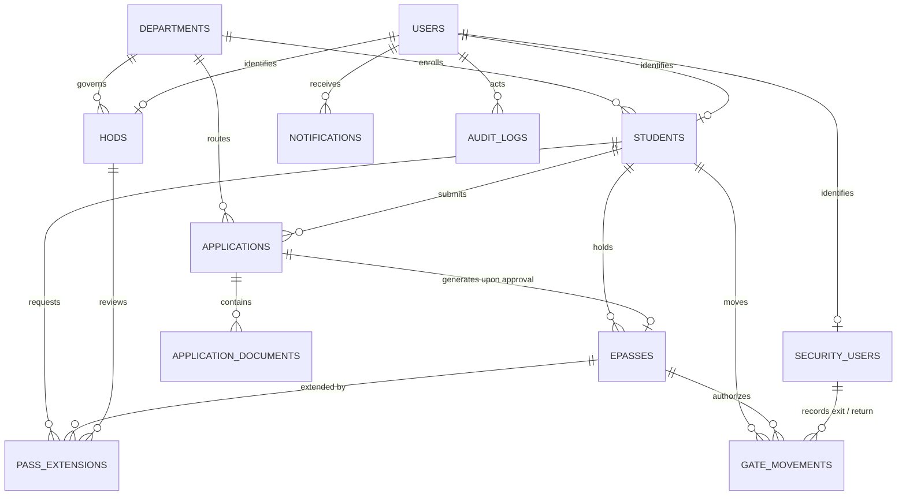

# CampusPass — Database Entity Relationship (ER) Specification

---

### 1. Conceptual ER Diagram (Mermaid)

---

### 2. Relational Schema Data Dictionary

#### 2.1 `departments`
- **Purpose**: Academic departments routing student applications to the correct HOD.
- **Primary Key**: `id` (BIGINT AUTO_INCREMENT)
- **Unique Keys**: `code` (VARCHAR(20))
- **Key Fields**: `name`, `description`, `is_active`

#### 2.2 `users`
- **Purpose**: System-wide authentication principal storing role and credentials.
- **Primary Key**: `id` (BIGINT AUTO_INCREMENT)
- **Unique Keys**: `username` (VARCHAR(50)), `email` (VARCHAR(100))
- **Key Fields**: `password_hash`, `role` (ENUM: STUDENT, HOD, SECURITY, ADMIN), `is_active`

#### 2.3 `students`
- **Purpose**: Academic & guardian profile for enrolled students.
- **Primary Key**: `id` (BIGINT AUTO_INCREMENT)
- **Foreign Keys**: `user_id` $\rightarrow$ `users(id)`, `department_id` $\rightarrow$ `departments(id)`
- **Unique Keys**: `user_id`, `roll_number`
- **Key Fields**: `semester`, `mobile`, `parent_name`, `parent_phone`, `student_photo_url`, `id_card_doc_url`

#### 2.4 `hods`
- **Purpose**: Faculty department heads authorized for approvals.
- **Primary Key**: `id` (BIGINT AUTO_INCREMENT)
- **Foreign Keys**: `user_id` $\rightarrow$ `users(id)`, `department_id` $\rightarrow$ `departments(id)`
- **Unique Keys**: `user_id`, `employee_id`
- **Key Fields**: `office_room`, `phone`

#### 2.5 `security_users`
- **Purpose**: Gate security guards operating the scanner terminal.
- **Primary Key**: `id` (BIGINT AUTO_INCREMENT)
- **Foreign Keys**: `user_id` $\rightarrow$ `users(id)`
- **Unique Keys**: `user_id`, `badge_id`
- **Key Fields**: `gate_number`, `phone`

#### 2.6 `applications`
- **Purpose**: Permission requests submitted by students.
- **Primary Key**: `id` (BIGINT AUTO_INCREMENT)
- **Foreign Keys**: `student_id` $\rightarrow$ `students(id)`, `department_id` $\rightarrow$ `departments(id)`
- **Unique Keys**: `application_number`
- **Key Fields**: `subject`, `reason_text`, `is_emergency`, `leave_date`, `leave_time`, `expected_return_date_time`, `status` (DRAFT, SUBMITTED, UNDER_REVIEW, CLARIFICATION_REQUIRED, RESUBMITTED, APPROVED, REJECTED, CANCELLED), `hod_remarks`
- **Strategic Indexes**: `(department_id, status)`, `(student_id)`, `(application_number)`

#### 2.7 `application_documents`
- **Purpose**: File attachments (PDF/Images) uploaded as evidence for an application.
- **Primary Key**: `id` (BIGINT AUTO_INCREMENT)
- **Foreign Keys**: `application_id` $\rightarrow$ `applications(id)` ON DELETE CASCADE
- **Key Fields**: `file_name`, `file_path`, `file_type`, `file_size_bytes`

#### 2.8 `epasses`
- **Purpose**: Digital permission passes issued upon HOD approval.
- **Primary Key**: `id` (BIGINT AUTO_INCREMENT)
- **Foreign Keys**: `application_id` $\rightarrow$ `applications(id)`, `student_id` $\rightarrow$ `students(id)`
- **Unique Keys**: `pass_number`, `application_id`, `qr_token`
- **Key Fields**: `valid_from`, `valid_until`, `status` (ACTIVE, EXPIRED, USED, REVOKED, COMPLETED), `issued_at`, `revoked_at`
- **Strategic Indexes**: `(qr_token)`, `(status)`, `(student_id)`

#### 2.9 `gate_movements`
- **Purpose**: Physical exit and return ledger recorded by security guards.
- **Primary Key**: `id` (BIGINT AUTO_INCREMENT)
- **Foreign Keys**: `pass_id` $\rightarrow$ `epasses(id)`, `student_id` $\rightarrow$ `students(id)`, `exit_security_id` $\rightarrow$ `security_users(id)`, `return_security_id` $\rightarrow$ `security_users(id)`
- **Key Fields**: `exit_time`, `expected_return_time`, `actual_return_time`, `movement_status` (OUTSIDE, RETURNED_ON_TIME, OVERDUE, RETURNED_OVERDUE), `gate_remarks`
- **Strategic Indexes**: `(pass_id)`, `(movement_status)`, `(student_id)`, `(expected_return_time)`

#### 2.10 `pass_extensions`
- **Purpose**: Requests submitted by students while outside campus to extend return time.
- **Primary Key**: `id` (BIGINT AUTO_INCREMENT)
- **Foreign Keys**: `pass_id` $\rightarrow$ `epasses(id)`, `student_id` $\rightarrow$ `students(id)`, `hod_id` $\rightarrow$ `hods(id)`
- **Key Fields**: `requested_return_time`, `reason`, `status` (PENDING, APPROVED, REJECTED), `hod_remarks`

#### 2.11 `notifications`
- **Purpose**: In-app alerts for all user types.
- **Primary Key**: `id` (BIGINT AUTO_INCREMENT)
- **Foreign Keys**: `user_id` $\rightarrow$ `users(id)` ON DELETE CASCADE
- **Key Fields**: `title`, `message`, `notification_type`, `is_read`, `reference_id`
- **Strategic Indexes**: `(user_id, is_read)`

#### 2.12 `audit_logs`
- **Purpose**: Immutable ledger recording all sensitive state transitions and actor actions.
- **Primary Key**: `id` (BIGINT AUTO_INCREMENT)
- **Key Fields**: `actor_user_id`, `actor_username`, `actor_role`, `action`, `entity_name`, `entity_id`, `ip_address`, `details`, `timestamp`
- **Strategic Indexes**: `(actor_user_id)`, `(entity_name, entity_id)`, `(timestamp)`

#### 2.13 `system_settings`
- **Purpose**: Dynamic institutional parameters (e.g. grace period).
- **Primary Key**: `id` (BIGINT AUTO_INCREMENT)
- **Unique Keys**: `setting_key`
- **Key Fields**: `setting_value`, `description`

---

### 3. Normalization Rationale
- **Third Normal Form (3NF) Compliance**: All non-key attributes depend solely on the candidate key. For example, student department information is stored as a foreign key reference (`department_id`) to `departments`, eliminating departmental redundancy across student and application records.
- **Optimized for High-Speed Gate Scans**: Indexing `epasses(qr_token)` and `gate_movements(pass_id, movement_status)` ensures query execution plans use index-seek lookups, resulting in sub-5ms gate verification latency.
