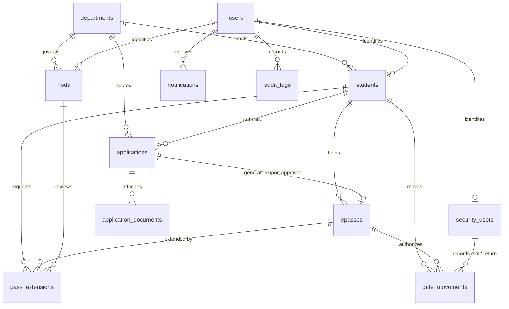

# CampusPass — Digital Student Permission & Gate Movement Management System


**CampusPass** is a real-world, enterprise-ready digital student permission application and gate movement tracking platform. It replaces outdated paper gate slips, manual HOD signatures, and physical gate registers with an end-to-end, cryptographically verified digital workflow.

---

## 1. Problem Solved

In typical colleges, students must physically write paper permission letters, stand outside HOD cabins for physical signatures, hand paper slips to gate security guards, and rely on manual gate register logbooks. This results in:
- Unnecessary academic interruptions for routine permissions.
- Inability to track which students are currently outside campus.
- Failure to reliably detect overdue students who missed their return deadlines.
- Security vulnerabilities (forged signatures, stolen slips, screenshot tampering).

**CampusPass digitizes the entire lifecycle:**
```
STUDENT APPLIES 
  ➜ HOD DECIDES (Approve / Reject / Clarification)
    ➜ DIGITAL E-PASS ISSUED (Secure QR Token)
      ➜ SECURITY VERIFIES & RECORDS EXIT (Status: OUTSIDE)
        ➜ AUTOMATED SCHEDULER MONITORS GRACE PERIOD (Detects OVERDUE)
          ➜ SECURITY VERIFIES & RECORDS RETURN (Status: COMPLETED)
            ➜ IMMUTABLE AUDIT TRAIL LOGGED
```

---

## 2. Key Features

### Student Module
- **Natural Language Justification**: Students write reasons in their own words (banking, medical, family, official work) without drop-down restrictions.
- **Emergency Flagging**: Urgent medical or family emergency requests receive priority triage by staff.
- **Clarification Loop**: Seamlessly reply to HOD clarification queries and attach additional supporting evidence without creating duplicate applications.
- **Digital E-Pass**: Instant access to an active pass containing student identity and a backend-verified QR code.
- **Pass Extension**: Request return time extensions when legitimately delayed off-campus.

### HOD Decision Desk
- **Departmental Inbox**: Triage queue filtered strictly by the HOD’s assigned academic department.
- **3-Way Actions**: Approve (generates E-Pass), Reject (mandatory reason required), or Ask Clarification.
- **Real-Time KPIs**: Real-time database metrics for Pending, Approved Today, Rejected Today, Currently Outside, and Overdue.
- **Live Movement Feed**: Real-time visibility into departmental students currently outside campus.

### Security Gate Terminal
- **High-Speed Camera Scanner**: Mobile/tablet-optimized camera scanner powered by `html5-qrcode` (with manual token input fallback).
- **Privacy-Preserving Verification**: Shows only operational data (Photo, Name, Roll No, Department, Allowed Departure, Expected Return). *Guards never see parent phone numbers or sensitive medical letters.*
- **One-Tap Actions**: One-click **Record Exit** and **Record Return**.
- **Live Overdue Alerts**: High-visibility warning banners when a student returns past their return time.

### Automated Background Engine (Spring `@Scheduled`)
- **Overdue Detection Task**: Inspects all active movements every 60 seconds. If `now > expectedReturnTime + gracePeriod`, the state automatically shifts to `OVERDUE` and dispatches in-app alerts to both the student and departmental HOD.
- **Pass Expiration Task**: Automatically marks unutilized approved passes as `EXPIRED` once their departure window closes.

### Administrator Console
- **User Management**: Onboard HODs, Security Guards, and toggle active/inactive status.
- **Academic Departments**: Create and manage academic units.
- **Dynamic Settings**: Configure institutional parameters (e.g., Grace Period in minutes, Max Pass Duration).
- **Audit Ledger**: Searchable, append-only audit trail logging all actions, actors, and timestamps.

---

## 3. System Architecture & Tech Stack

```
[ Frontend: HTML5 / CSS3 / Vanilla ES6+ JavaScript / Bootstrap 5 / HTML5-QRCode ]
                                      │
                                      ▼ HTTPS / REST API
[ Security: Spring Security 6.x / Stateless HMAC-SHA256 JWT / BCrypt ]
                                      │
                                      ▼ DTO Validation (@Valid)
[ Service Layer: Spring Boot 3.4.1 / State Machine / Overdue Scheduler ]
                                      │
                                      ▼ JPA / Hibernate ORM / HikariCP
[ Data Layer: MySQL 8.x (InnoDB, Foreign Keys, Performance Indexes) ]
```

- **Backend**: Java 21 LTS, Spring Boot 3.4.1, Spring Data JPA, Spring Security 6, JJWT 0.12.6, Google ZXing 3.5.3.
- **Database**: MySQL 8.x (Production) / H2 in-memory (Integration Testing).
- **Frontend**: Bootstrap 5.3, Bootstrap Icons, HTML5-QRCode scanner, Vanilla ES6 JavaScript (Zero heavy node build dependencies).

---

## 4. Database Schema (13 Normalized Tables)



1. `users`: Credentials, BCrypt password hash, role (`STUDENT`, `HOD`, `SECURITY`, `ADMIN`), active status.
2. `departments`: Code (`CSE`, `IT`, etc.), name, description.
3. `students`: User reference, roll number, semester, mobile, parent contact, photo URL.
4. `hods`: User reference, department reference, employee ID, office room, phone.
5. `security_users`: User reference, badge ID, gate number, phone.
6. `applications`: Subject, reason text, emergency flag, departure date/time, expected return, status (`SUBMITTED`, `UNDER_REVIEW`, `CLARIFICATION_REQUIRED`, `RESUBMITTED`, `APPROVED`, `REJECTED`, `CANCELLED`).
7. `application_documents`: Attached PDFs, images, file size, storage path.
8. `epasses`: Unique pass number, QR token (`urn:campuspass:token:<UUID>`), validity window, status (`ACTIVE`, `EXPIRED`, `USED`, `REVOKED`, `COMPLETED`).
9. `gate_movements`: Exit security, exit timestamp, expected return, return security, actual return, status (`OUTSIDE`, `RETURNED_ON_TIME`, `OVERDUE`, `RETURNED_OVERDUE`).
10. `pass_extensions`: Requested return time, reason, HOD decision, status (`PENDING`, `APPROVED`, `REJECTED`).
11. `notifications`: In-app alerts, read status, reference ID.
12. `audit_logs`: Immutable ledger of actor, role, action, target entity, timestamp, IP.
13. `system_settings`: Key-value institutional policies (e.g., `GRACE_PERIOD_MINUTES`).

---

## 5. Security Architecture

1. **Zero Personally Identifiable Information (PII) in QR**:
   - The QR code contains ONLY a secure, cryptographically random high-entropy token (`urn:campuspass:token:<UUID>`).
   - QR codes NEVER store plain student names or parent phone numbers.
2. **Backend-Mediated Verification**:
   - Security gate scans query the backend database to check token validity, active state, departure time windows, and current movement status.
   - Prevents screenshot spoofing, pass sharing, and duplicate exits.
3. **Single-Pass State Invariance**:
   - An active pass can be used for **exactly one exit** and **exactly one return**.
   - Attempting to scan an already completed pass returns `ALREADY_RETURNED`.
4. **Hardened File Storage**:
   - Uploaded files are renamed with UUIDs and stored outside the web root to prevent path traversal attacks.
   - Strict extension whitelist (`.pdf`, `.png`, `.jpg`, `.jpeg`) with a 5MB size limit.

---

## 6. Quick Start & Execution

### Prerequisites
- **JDK 21** or higher (`java -version`)
- **Maven 3.9+** (`mvn -version`)
- **MySQL 8.x** (Service running on port 3306)

### Database Setup
Create database in MySQL (or let Spring Boot create it automatically):
```sql
CREATE DATABASE IF NOT EXISTS campuspass_db CHARACTER SET utf8mb4 COLLATE utf8mb4_unicode_ci;
```

### Running the Application
```powershell
# 1. Compile and run all integration tests
mvn test

# 2. Package into a standalone runnable JAR
mvn package

# 3. Start the application
java -jar target/campuspass-1.0.0-SNAPSHOT.jar
```

Or run directly with Maven:
```powershell
mvn spring-boot:run
```

Once started, open your web browser at:
👉 **`http://localhost:8080`**

---

## 7. Pre-Seeded Demo Accounts

The application automatically seeds default accounts on startup for immediate testing:

| Role | Username | Password | Role Description |
| :--- | :--- | :--- | :--- |
| **Student** | `student1` | `Password@123` | Enrolled CSE student (`22CS101`) |
| **HOD** | `hod_cse` | `Password@123` | Head of Computer Science (`Room 302`) |
| **Security** | `security_gate1`| `Password@123` | Main North Gate Security (`SEC-001`) |
| **Admin** | `admin` | `Password@123` | Institutional Administrator |

*(The login page at `http://localhost:8080` also provides 1-click **Quick Demo Account Fill** buttons for convenience!)*

---

## 8. REST API Summary

| Method | Endpoint | Description | Role Required |
| :--- | :--- | :--- | :--- |
| `POST` | `/api/v1/auth/login` | Authenticate credentials & return JWT | Public |
| `POST` | `/api/v1/auth/register-student` | Self-register student account | Public |
| `GET` | `/api/v1/auth/me` | Fetch authenticated user profile | Authenticated |
| `POST` | `/api/v1/applications` | Create permission application (Multipart) | `ROLE_STUDENT` |
| `GET` | `/api/v1/applications/my` | View my permission history | `ROLE_STUDENT` |
| `POST` | `/api/v1/applications/{id}/clarification`| Respond to HOD clarification query | `ROLE_STUDENT` |
| `DELETE` | `/api/v1/applications/{id}/cancel` | Cancel pending application | `ROLE_STUDENT` |
| `GET` | `/api/v1/epasses/my-active` | Fetch active digital E-Pass & QR Base64 | `ROLE_STUDENT` |
| `POST` | `/api/v1/epasses/{id}/request-extension` | Submit return time extension | `ROLE_STUDENT` |
| `GET` | `/api/v1/hod/dashboard` | Real-time department KPIs | `ROLE_HOD` |
| `GET` | `/api/v1/hod/applications` | Department pending review queue | `ROLE_HOD` |
| `POST` | `/api/v1/hod/applications/{id}/approve` | Approve application & issue E-Pass | `ROLE_HOD` |
| `POST` | `/api/v1/hod/applications/{id}/reject` | Reject application with reason | `ROLE_HOD` |
| `POST` | `/api/v1/hod/applications/{id}/clarify` | Request clarification from student | `ROLE_HOD` |
| `GET` | `/api/v1/hod/live-movement` | Department students currently outside | `ROLE_HOD` |
| `POST` | `/api/v1/security/verify` | Scan & verify QR token | `ROLE_SECURITY` |
| `POST` | `/api/v1/security/record-exit` | Record student exit at gate | `ROLE_SECURITY` |
| `POST` | `/api/v1/security/record-return` | Record student return at gate | `ROLE_SECURITY` |
| `GET` | `/api/v1/security/currently-outside` | Live campus-wide outside feed | `ROLE_SECURITY` |
| `GET` | `/api/v1/security/overdue-students` | Live campus-wide overdue feed | `ROLE_SECURITY` |
| `GET` | `/api/v1/admin/dashboard` | Institutional metric overview | `ROLE_ADMIN` |
| `POST` | `/api/v1/admin/users/staff` | Create HOD or Security account | `ROLE_ADMIN` |
| `PUT` | `/api/v1/admin/settings` | Update grace period & pass rules | `ROLE_ADMIN` |
| `GET` | `/api/v1/admin/audit-logs` | Inspect system-wide audit ledger | `ROLE_ADMIN` |

*A complete, importable Postman collection is included in [POSTMAN_COLLECTION.json](file:///C:/Users/vijay%20yadav/Desktop/my-portfolioo/POSTMAN_COLLECTION.json).*

---

## 9. Verification & Test Suite

The test suite covers full Spring Boot context initialization, data models, JWT security filters, and end-to-end integration workflows:

```powershell
mvn test
```

### Test Results
```
[INFO] Running com.campuspass.ApplicationWorkflowTests
[INFO] Tests run: 1, Failures: 0, Errors: 0, Skipped: 0, Time elapsed: 11.54 s -- in com.campuspass.ApplicationWorkflowTests
[INFO] Running com.campuspass.CampusPassApplicationTests
[INFO] Tests run: 1, Failures: 0, Errors: 0, Skipped: 0, Time elapsed: 0.019 s -- in com.campuspass.CampusPassApplicationTests
[INFO] 
[INFO] Results:
[INFO] Tests run: 2, Failures: 0, Errors: 0, Skipped: 0
[INFO] ------------------------------------------------------------------------
[INFO] BUILD SUCCESS
[INFO] ------------------------------------------------------------------------
```

---

## 10. Future Enhancements (Post-MVP)
- **Parent Portal**: Dedicated guardian view for tracking ward exit/entry.
- **SMS / WhatsApp Gateway**: Pluggable Twilio/Gupshup SMS alerts on overdue events.
- **RFID / Biometric Gate Readers**: Secondary physical card validation alongside QR tokens.
- **Multi-Gate Fleet Routing**: Tracking specific campus entry/exit gate checkpoints.
